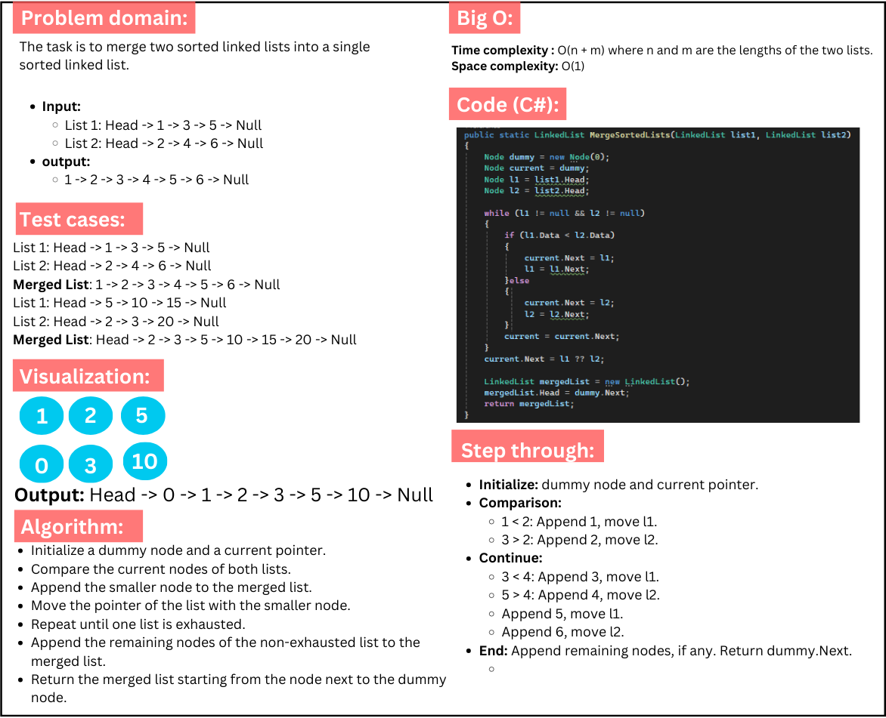
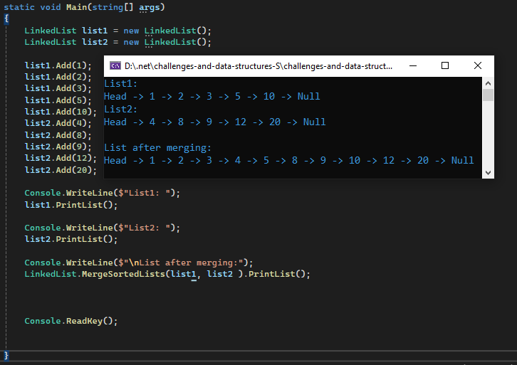

# Challenge 9: Merge Two sorted linked lists

### MergeSortedLists method takes two sorted linked list and merge them, then returns one sorted linked list.

## Whiteboard images:

### Merge Sorted Lists:

---

## Code run:
