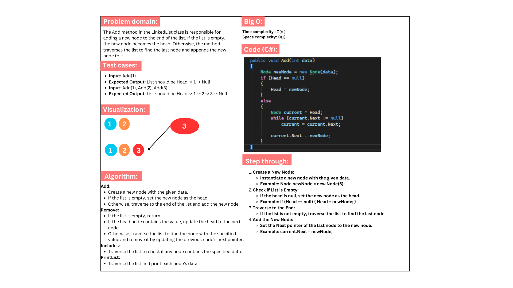
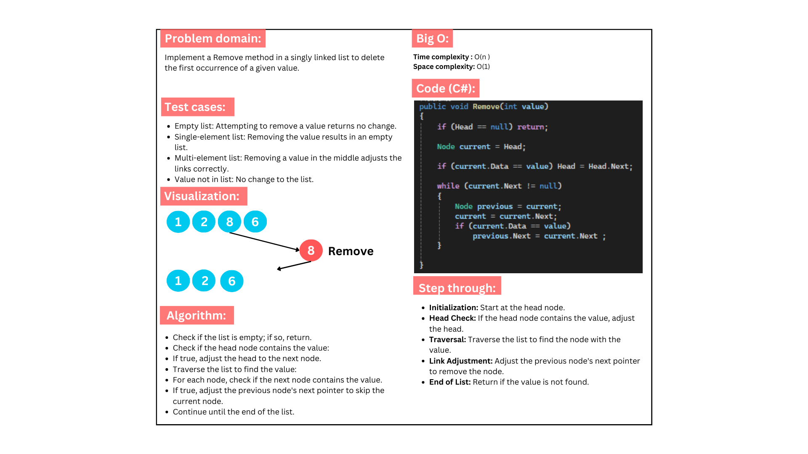
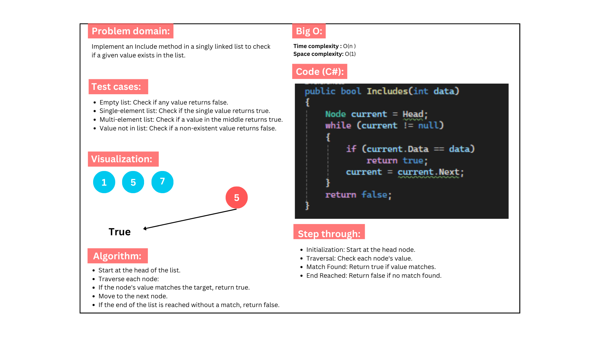
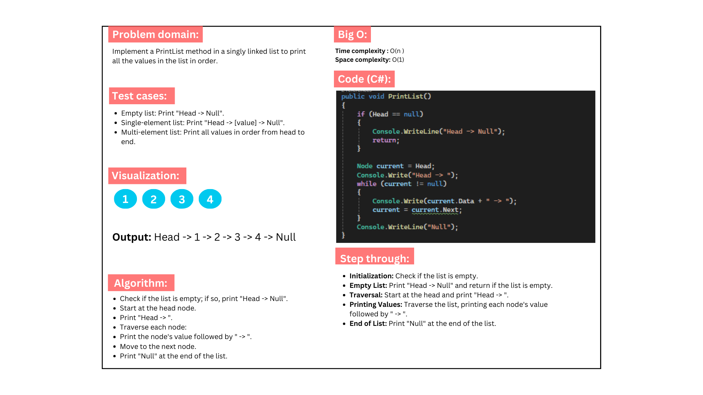
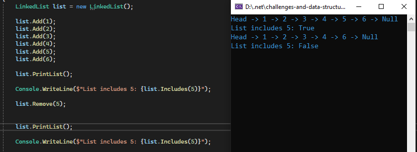

# Challenge 7: Linked List Implementation

### This class constains an implementation of the linked list with some manpulation methods.

## Whiteboard images:

### Add:

---

### Remove:

---

### Includes:

---

### PrintList:

---

## Code run:

---