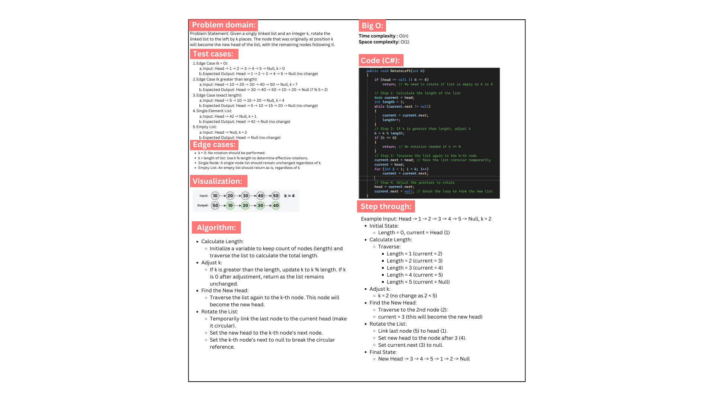
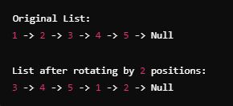

# Challenge : Rotate Linked List Left by K Places

## Description

This project involves implementing a function to rotate a singly linked list to the left by `k` positions. The goal is to take a linked list, shift its elements such that the node originally at position `k` becomes the new head, with the remaining elements following in the same order. The solution uses the existing `Node` and `LinkedList` classes, and includes a new method `RotateLeft(int k)` within the `LinkedList` class to achieve this functionality.

## The method works by:
- First, calculating the length of the linked list.
- If `k` exceeds the length of the list, the rotation value is reduced to `k % length`.
- Traversing the list to the node at position `k`.
- Reconfiguring the pointers so that the node at position `k` becomes the new head of the list, while ensuring the rest of the list follows and the structure remains intact.

This project also includes unit tests implemented using xUnit to ensure the solution works as expected for various edge cases, such as rotating the list by `k = 0`, handling values of `k` greater than the length of the list, and maintaining the list's structure when it's empty or contains only one element.

## Whiteboard image:

---

## Code run:
