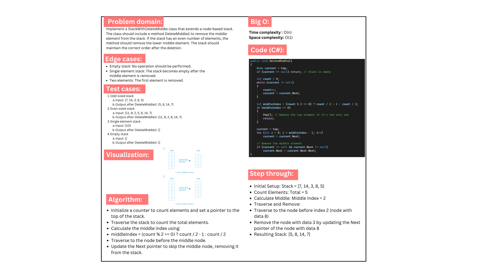
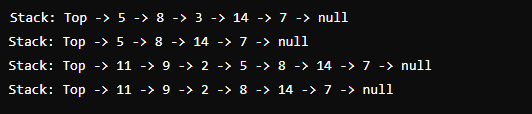

# Delete Middle Element of a stack
### Implement a method to delete the middle element of a stack. The stack class should be extended to include this functionality. The solution should handle various cases, including a stack with multiple elements, a single element, and an empty stack.

## Whiteboard image:

## Code run:
