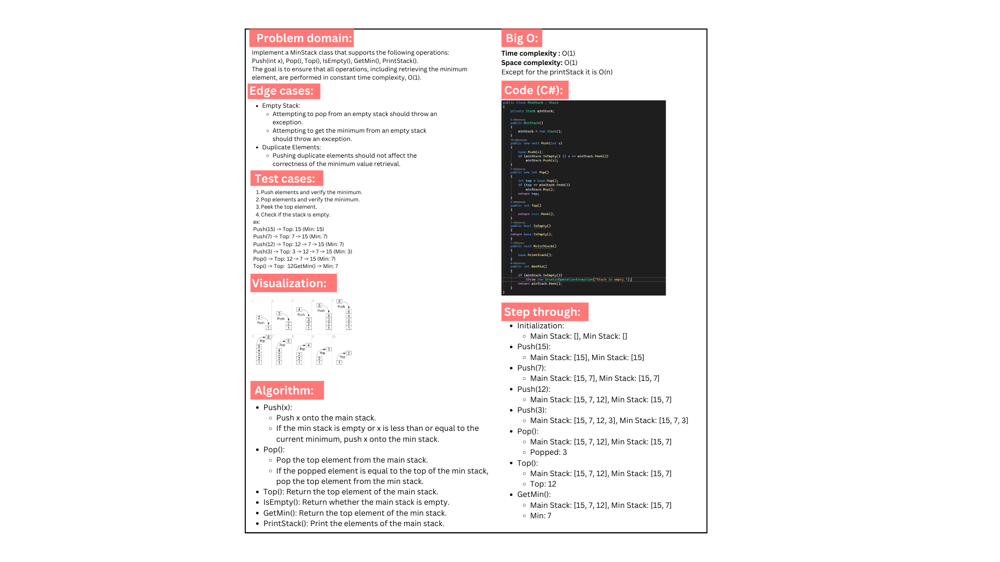

# MinStack implementation
### MinStack implementation in C# with O(1) time complexity for retrieving the minimum element. Supports push, pop, top, isEmpty, getMin, and printStack operations. Includes a main program demonstrating usage and expected outputs.
## Whiteboard image:

## Output:
