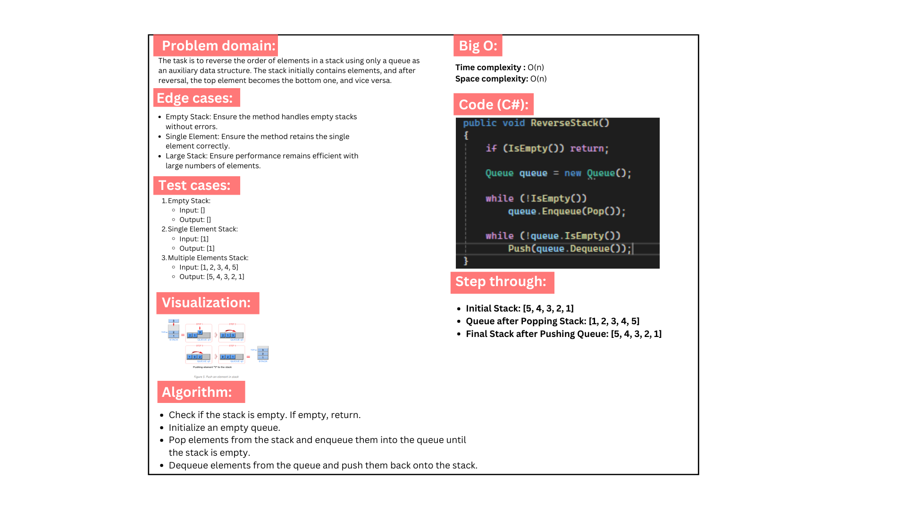
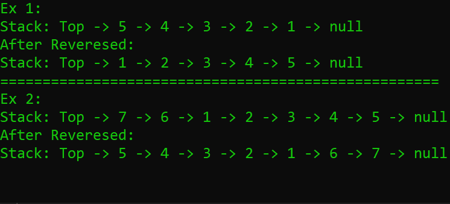

# Reverse a Stack using Queue
### Implement a method to reverse a stack's elements using a queue. The stack class should be extended to include this functionality. The solution should handle various cases, including reversing a stack with multiple elements, a single element, and an empty stack.

## Whiteboard image:

## Code run:
