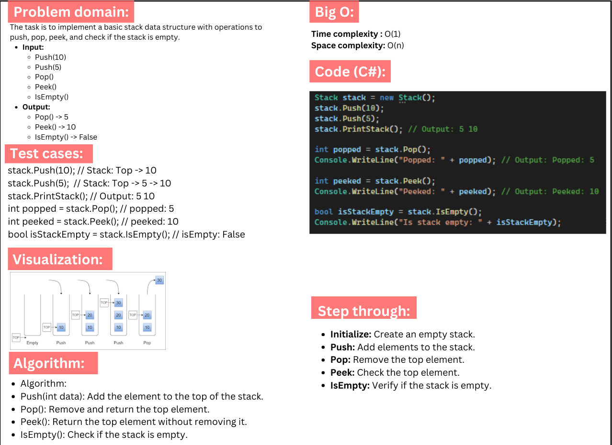
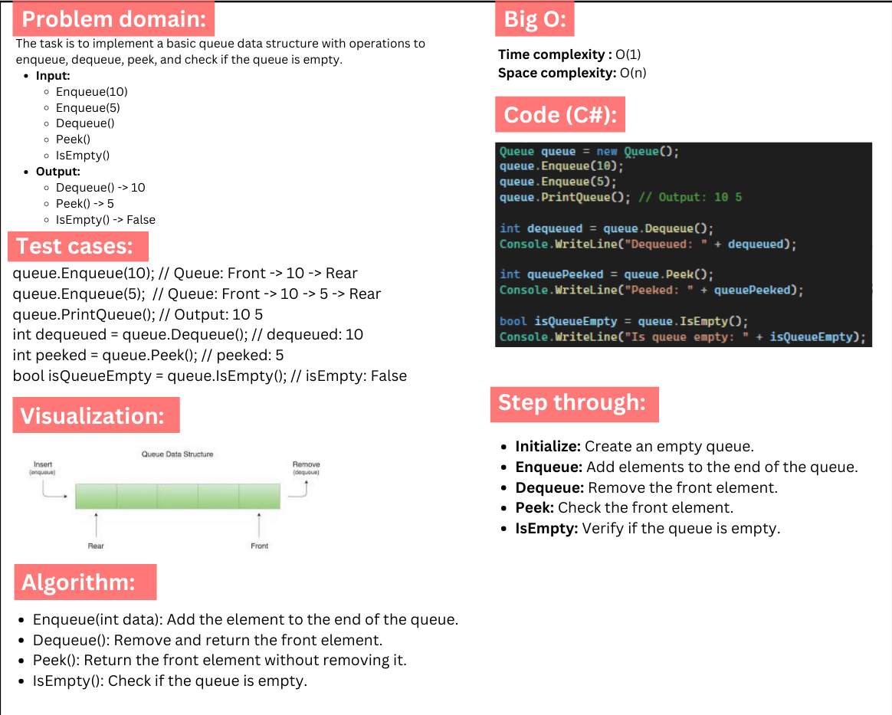

# Stack and Queue Implementation in C#

## Problem Domain

This project implements two fundamental data structures: **Stack** and **Queue**. Each data structure includes methods for standard operations such as adding, removing, and peeking at elements.

### Stack
A **Stack** follows the Last-In-First-Out (LIFO) principle. The main operations are:
- `Push(int data)`: Adds an element to the top of the stack.
- `Pop()`: Removes and returns the top element.
- `Peek()`: Returns the top element without removing it.
- `IsEmpty()`: Checks if the stack is empty.

### Queue
A **Queue** follows the First-In-First-Out (FIFO) principle. The main operations are:
- `Enqueue(int data)`: Adds an element to the end of the queue.
- `Dequeue()`: Removes and returns the front element.
- `Peek()`: Returns the front element without removing it.
- `IsEmpty()`: Checks if the queue is empty.

## Whiteboard:

### Stack


### Queue



## Output Example


```csharp
Stack stack = new Stack();
stack.Push(10);
stack.Push(5);
stack.PrintStack(); // Output: 5 10

int popped = stack.Pop();
Console.WriteLine("Popped: " + popped); // Output: Popped: 5

int peeked = stack.Peek();
Console.WriteLine("Peeked: " + peeked); // Output: Peeked: 10

bool isStackEmpty = stack.IsEmpty();
Console.WriteLine("Is stack empty: " + isStackEmpty); // Output: Is stack empty: False


Queue queue = new Queue();
queue.Enqueue(10);
queue.Enqueue(5);
queue.PrintQueue(); // Output: 10 5

int dequeued = queue.Dequeue();
Console.WriteLine("Dequeued: " + dequeued); // Output: Dequeued: 10

int queuePeeked = queue.Peek();
Console.WriteLine("Peeked: " + queuePeeked); // Output: Peeked: 5

bool isQueueEmpty = queue.IsEmpty();
Console.WriteLine("Is queue empty: " + isQueueEmpty); // Output: Is queue empty: False


