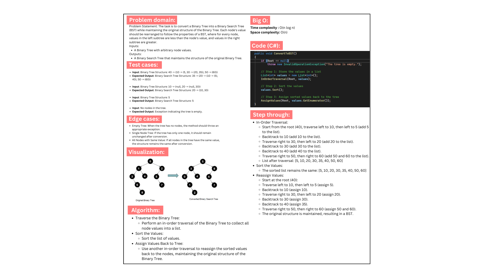
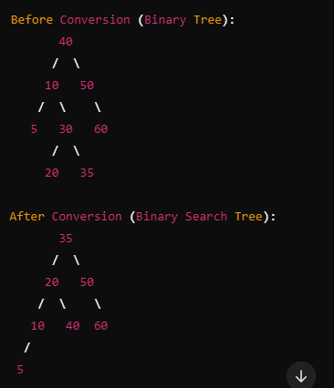

# Binary Tree to Binary Search Tree Converter

## Description
This project implements a method to convert a given Binary Tree into a Binary Search Tree (BST) while preserving the original structure of the Binary Tree. The conversion ensures that for each node, the values in the left subtree are less than the node's value, and the values in the right subtree are greater. The project includes test cases to validate the functionality and handles various scenarios, including single-node trees, one-sided trees, trees with duplicate values, and empty trees.

## Whiteboard:

## output:

