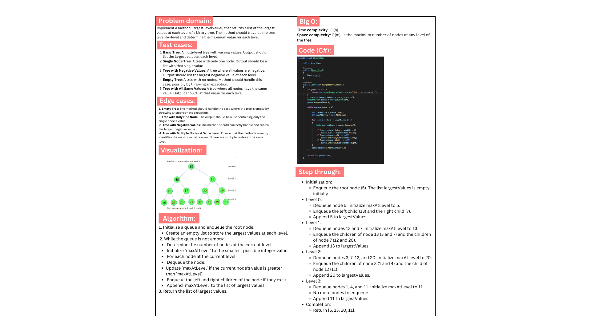
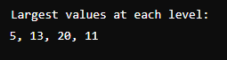

# Largest Level Value

## Introduction

This project implements a binary tree and provides functionality to find the largest value at each level of the tree. The `LargestLevelValue` method traverses the binary tree level by level and returns a list of the largest values found at each level.

## Whiteboard:

## Code run:

## Functionality

- **Binary Tree Structure**: Defines a binary tree with nodes containing integer values.
- **Largest Level Value Calculation**: Computes the largest value at each level of the tree and returns these values in a list.
