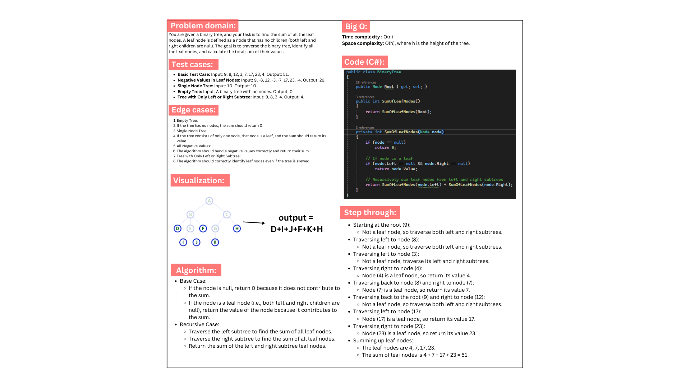

# Sum of Leaf Nodes in a Binary Tree

## Problem Description

The challenge is to implement a method that calculates the sum of all leaf nodes in a binary tree. A leaf node is a node that does not have any children. The method should traverse the tree, identify the leaf nodes, and sum their values.

## Whiteboard:

## output:

## Approach

1. **Tree Traversal:** 
   - We will traverse the tree using a recursive approach. For each node, we will check if it is a leaf node (i.e., it has no children).
   - If the node is a leaf, its value will be added to the sum.
   - If the node is not a leaf, we will recursively traverse its left and right subtrees.

2. **Method Implementation:** 
   - We created a `SumOfLeafNodes` method in the `BinaryTree` class. This method initializes the recursive process to sum the values of all leaf nodes.

3. **Edge Cases:**
   - An empty tree should return a sum of 0.
   - A tree with only one node (which is also a leaf) should return the value of that node.

## Algorithm (Recursive Approach)

1. **Base Case:**
   - If the node is `null`, return `0`.
   - If the node has no children (i.e., it is a leaf node), return its value.
   
2. **Recursive Case:**
   - Recursively traverse the left and right subtrees to find all leaf nodes.
   - Sum the values returned from the left and right subtrees.