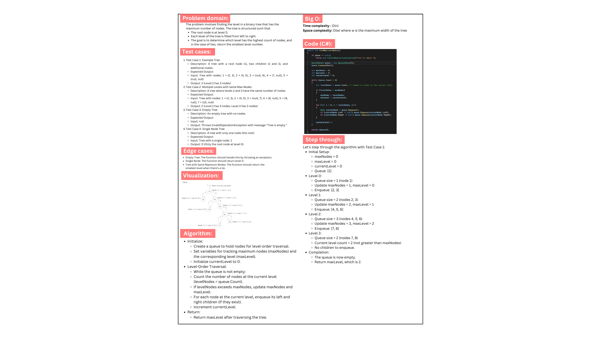
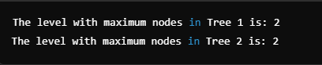

# Binary Tree Maximum Nodes Level Finder

This project implements a binary tree data structure with a method to find the level that contains the maximum number of nodes. The algorithm traverses the tree level by level, counting the nodes at each level, and returns the level number with the highest count. In the case of ties, it returns the smallest level. The implementation handles edge cases such as empty trees, single-node trees, and multiple levels having the same maximum node count.

## Whiteboard:

## Output example:

