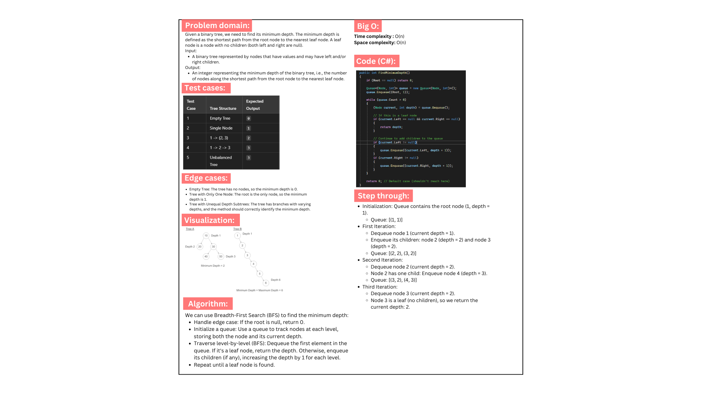

# Binary Tree Minimum Depth

This project implements a method to find the minimum depth of a binary tree. The minimum depth is defined as the shortest path from the root node to the nearest leaf node. The solution utilizes a Breadth-First Search (BFS) algorithm to efficiently determine the minimum depth, ensuring that the first leaf node encountered provides the answer.

## Whiteboard:

## Output example:

The minimum depth of the binary tree is: 2