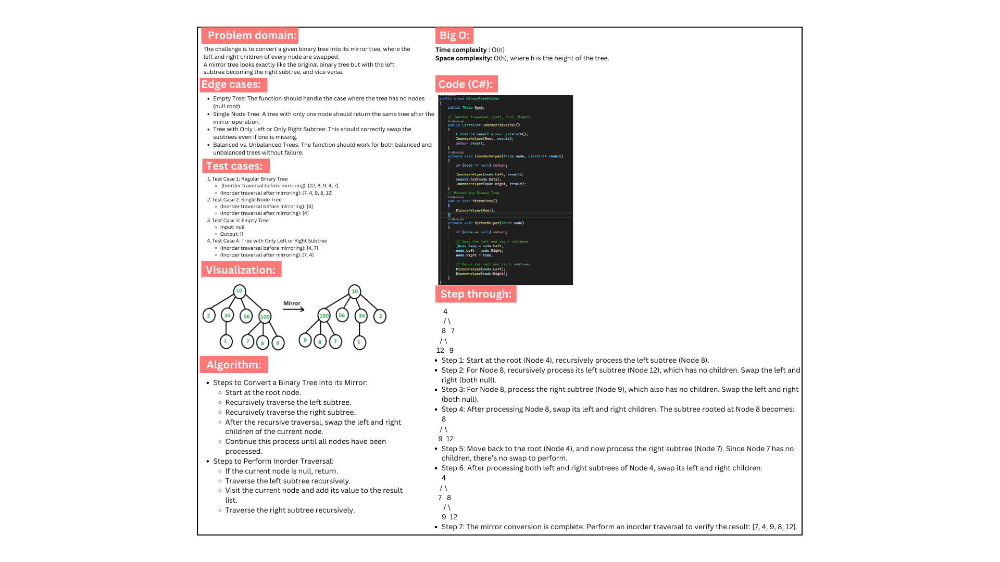

# Binary Tree Mirror Project

This project implements a Binary Tree in C# with the ability to convert it into its mirror. The mirror of a binary tree swaps the left and right children at every node. The project also includes an inorder traversal method to display the tree nodes in sequence and xUnit tests to validate functionality.

## Features

- **MirrorTree()**: Converts a binary tree into its mirror by swapping left and right subtrees at every node.
- **InorderTraversal()**: Performs an inorder traversal of the binary tree and returns the sequence of nodes.
  
## Whiteboard:

## Code run:

