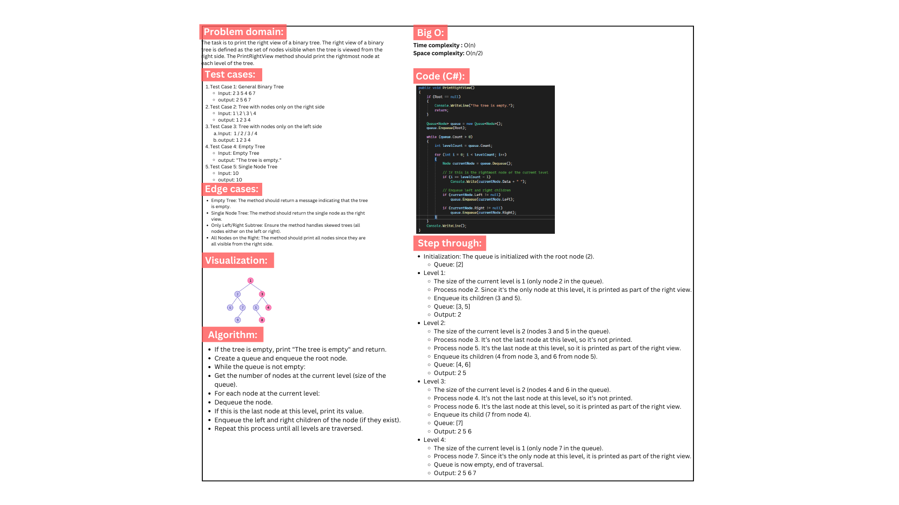
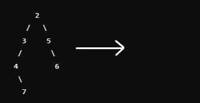

# Binary Tree Right View Project

This project implements a Binary Tree in C# with the ability to print the right view of the tree. The right view consists of the set of nodes visible when the tree is viewed from the right side. The project also includes a method to traverse the tree level by level and xUnit tests to validate functionality.

## Features

- **PrintRightView()**: Prints the rightmost node of each level of the binary tree, representing the right view when viewed from the right side.
- **LevelOrderTraversal()**: Performs a level-order traversal (BFS) of the binary tree to ensure each node is processed correctly for the right view.

## Whiteboard:

## Code run:

