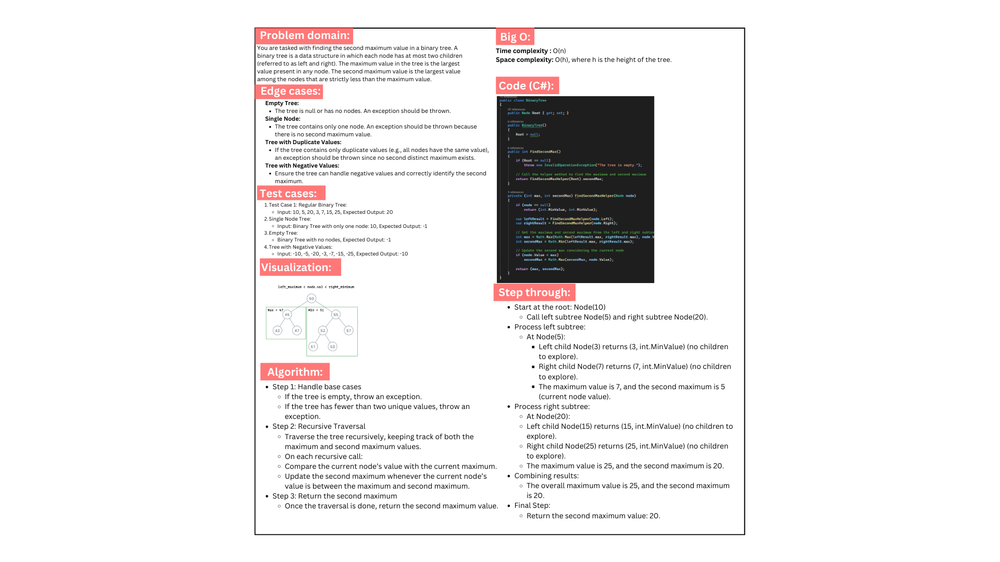
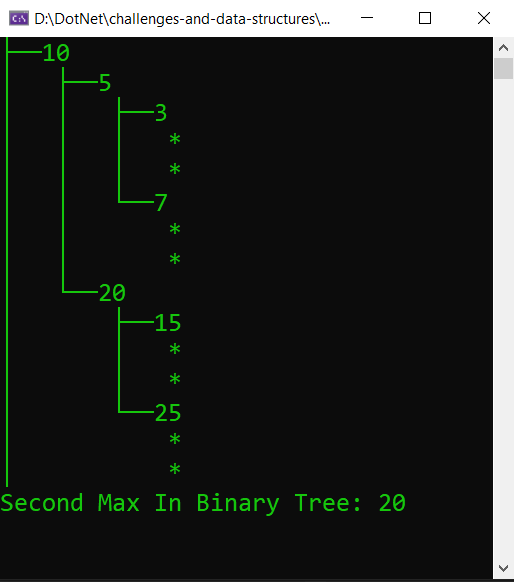

# Second Max Value Tree

Finding the second maximum value in a binary tree. A binary tree is a data structure in which each node has at most two children (referred to as left and right). The maximum value in the tree is the largest value present in any node. The second maximum value is the largest value among the nodes that are strictly less than the maximum value.

## Whiteboard:

## Code run:

