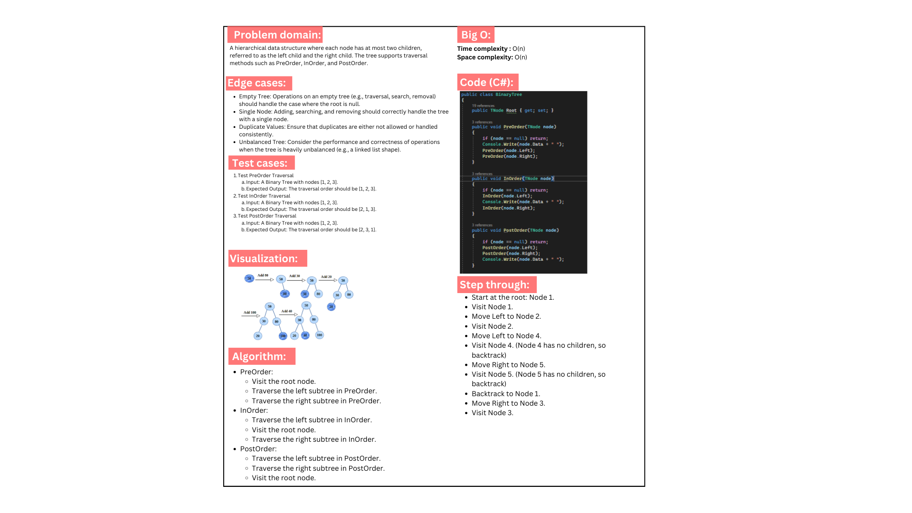
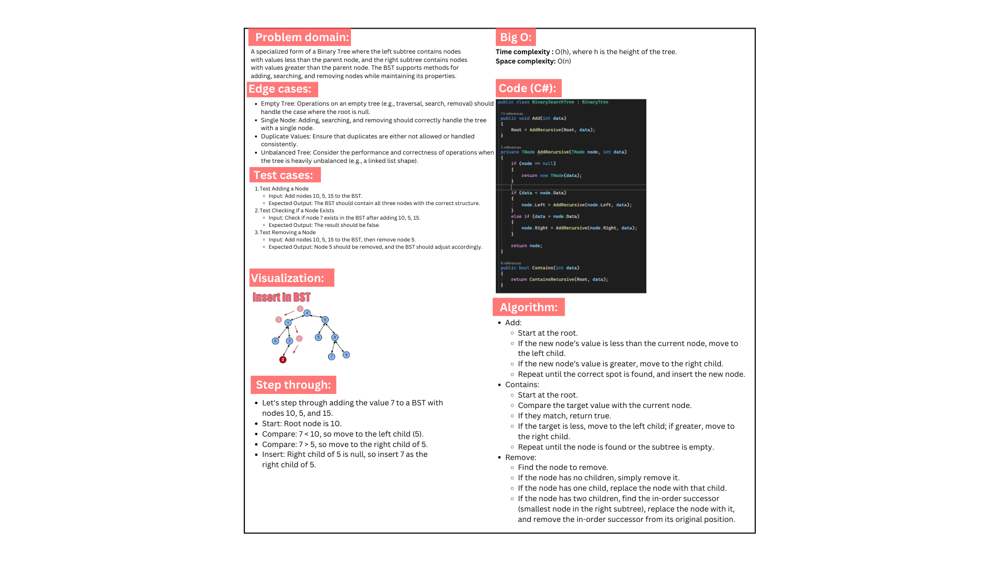

# Binary Tree and Binary Search Tree in C#

This project implements two fundamental data structures: a Binary Tree and a Binary Search Tree (BST) in C#. The project includes various traversal methods for the Binary Tree and essential operations for the Binary Search Tree, such as adding, searching, and removing nodes.

## Whiteboards:

### Binary Tree:

### Binary Search Tree:

## Code run:

## Features

### Binary Tree

- **PreOrder Traversal**: Traverse the tree in pre-order (Root, Left, Right).
- **InOrder Traversal**: Traverse the tree in in-order (Left, Root, Right).
- **PostOrder Traversal**: Traverse the tree in post-order (Left, Right, Root).
- **Print**: Display the tree in a structured way on the console.

### Binary Search Tree (BST)

- **Add(int data)**: Add a node with the specified data in the correct location to maintain BST properties.
- **Contains(int data)**: Check if a node with the specified data exists in the tree.
- **Remove(int data)**: Remove a node with the specified data while maintaining BST properties.

## Class Structure

### Node Class

The `Node` class represents each node in the tree and includes:
- `int Data`: The data stored in the node.
- `Node Left`: A reference to the left child node.
- `Node Right`: A reference to the right child node.

### BinaryTree Class

The `BinaryTree` class provides methods for different tree traversals:
- `PreOrder()`: Traverse the tree in pre-order.
- `InOrder()`: Traverse the tree in in-order.
- `PostOrder()`: Traverse the tree in post-order.
- `Print()`: Print the tree structure to the console.

### BinarySearchTree Class

The `BinarySearchTree` class provides methods for common operations:
- `Add(int data)`: Add a new node to the BST.
- `Contains(int data)`: Check if a node exists in the BST.
- `Remove(int data)`: Remove a node from the BST.
